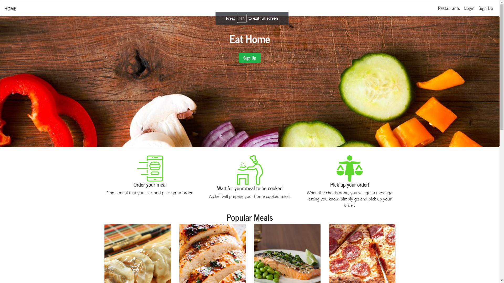

# [Eat Home]

Visit: [https://young-brushlands-73120.herokuapp.com/](https://young-brushlands-73120.herokuapp.com/) 

## About
This web application allows users to create their own restaurants online and in their own kitchen. Users can search for home cooked meals around their area. 

## Search function React
  Enter a location where you want to search for restaurants and React filters out the restaurants without reloading the page.

## Built With

* Sequelize ORM

* React

* MySQL / JawsDB

* Node.js

* Passport.js

* Google Cloud Platform

* Many more...

## Authors

Michael Wu -  [github.com/wufasa](https://github.com/wufasa)
Jack Li - [github.com/lijaack](https://github.com/lijaack)
Oleg Hansen - [github.com/oleg-bc](https://github.com/oleg-bc)
Arnesh Regmi - [github.com/arnesh23](https://github.com/arnesh23)

## License
This project is licensed under the MIT License - see the LICENSE.md file for details.

